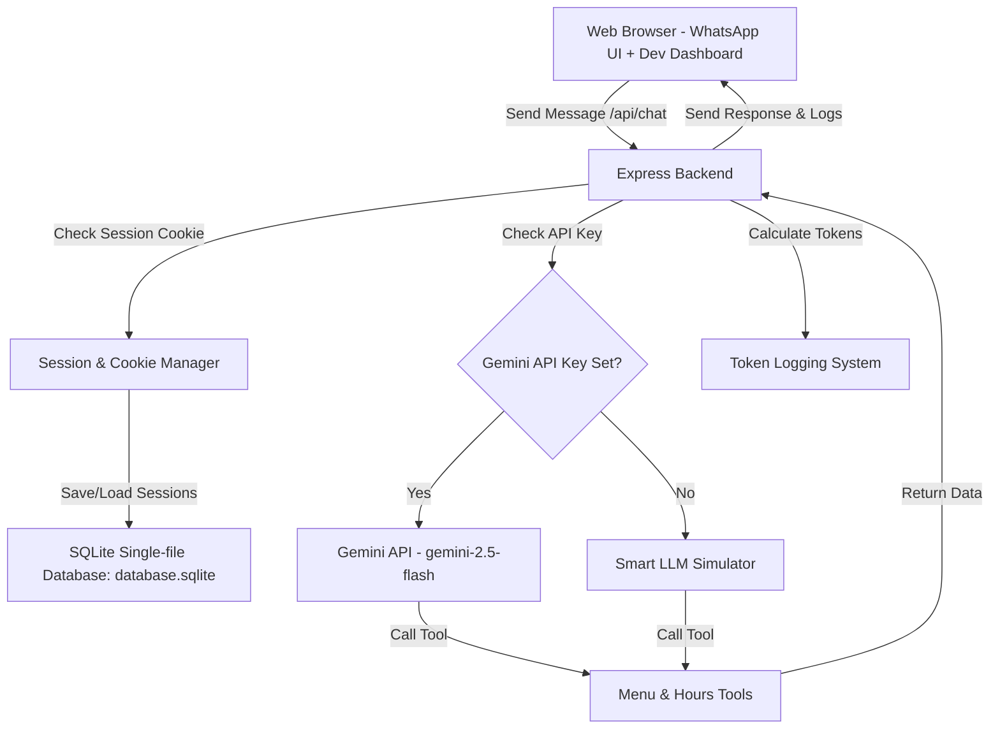

# Implementation Plan: WhatsApp Chatbot for Uncle Peter's Pancakes with SQLite Database & Token Logging

We will build a fully functioning WhatsApp-like web application viewport for **Uncle Peter's Pancake Shop** (Ludhiana), combined with a **Developer Token Tracking Dashboard**. The application will feature a Node.js Express backend and a premium HTML/CSS/JS frontend.

To make this extremely easy for a beginner to run immediately, the project will feature:
1. **SQLite Database**: A real, zero-config relational database stored in a single file (`database.sqlite`) in the project directory. It stores chat history, session details, and token logs.
2. **Gemini Live Mode**: Connects to the real Gemini API to process messages, call tools, and count tokens.
3. **Smart Simulator Mode**: A high-fidelity local simulator that runs automatically if no Gemini API Key is provided. It mimics the token usage, tool calling (fetching menu/hours), and response times, allowing you to test it instantly without setting up keys.

---

## Architecture & Database Design



### Database Schema (SQLite)

We will use two tables in `database.sqlite` to track data:

#### Table 1: `sessions`
Stores metadata about each client connection.
* `session_id` (TEXT, Primary Key): Unique session UUID.
* `created_at` (TEXT): ISO timestamp when the session was created.
* `last_active` (TEXT): ISO timestamp of the last message sent.
* `total_tokens` (INTEGER): Cumulative total of tokens used in this session.

#### Table 2: `chat_logs`
Stores the messages and a detailed token breakdown for every interaction.
* `id` (INTEGER, Primary Key, Autoincrement): Unique row ID.
* `session_id` (TEXT): Foreign key referencing the session.
* `timestamp` (TEXT): ISO timestamp of the turn.
* `user_message` (TEXT): What the user typed.
* `agent_response` (TEXT): What the chatbot replied.
* `system_tokens` (INTEGER): Tokens used by the system instruction.
* `user_tokens` (INTEGER): Tokens used by the user's input.
* `tool_tokens` (INTEGER): Tokens used by tool definitions/outputs.
* `agent_tokens` (INTEGER): Tokens used by the response generation.
* `total_tokens` (INTEGER): Sum of tokens for this turn.
* `step_logs` (TEXT): JSON-stringified array of detailed execution steps (e.g. `["Checked opening hours", "Parsed menu item"]`).

---

## File Structure

We will place all project files in `d:\pancake-chatbot`:

- **[package.json](file:///d:/pancake-chatbot/package.json)**: Node.js project configuration and dependencies (`express`, `dotenv`, `cookie-parser`, `@google/generative-ai`, `uuid`, `sqlite3`).
- **[.env](file:///d:/pancake-chatbot/.env)**: Environment variables (like `GEMINI_API_KEY` and `PORT`).
- **[server.js](file:///d:/pancake-chatbot/server.js)**: Node.js Express server. Initializes the SQLite database, declares tools, handles chatbot route `/api/chat`, manages session cookies, counts tokens, and runs simulator fallback.
- **[public/index.html](file:///d:/pancake-chatbot/public/index.html)**: The frontend page containing:
  1. A realistic WhatsApp phone viewport (mobile phone mockup).
  2. A developer panel showing real-time token logs, cookies, and timestamps.
- **[public/style.css](file:///d:/pancake-chatbot/public/style.css)**: Premium styling using Vanilla CSS (WhatsApp green theme + Glassmorphism developer panel).
- **[public/app.js](file:///d:/pancake-chatbot/public/app.js)**: Frontend logic that controls the chat interface, sends messages to the backend, updates the token dashboard, and handles UI animations.

---

## Proposed Changes & Code Outline

### 1. Project Dependencies

We will use the standard `sqlite3` npm package to manage the local database:

```json
{
  "name": "pancake-chatbot",
  "version": "1.0.0",
  "description": "WhatsApp chatbot with SQLite token tracking for Uncle Peter's Pancakes",
  "main": "server.js",
  "scripts": {
    "start": "node server.js",
    "dev": "nodemon server.js"
  },
  "dependencies": {
    "@google/generative-ai": "^0.21.0",
    "cookie-parser": "^1.4.6",
    "dotenv": "^16.4.5",
    "express": "^4.19.2",
    "sqlite3": "^5.1.7",
    "uuid": "^9.0.1"
  },
  "devDependencies": {
    "nodemon": "^3.1.0"
  }
}
```

### 2. Environment Variables (`.env`)

```env
PORT=3000
# Optional Gemini API Key (e.g. AIzaSy...)
# If left empty, the application will run in "Simulator Mode" automatically.
GEMINI_API_KEY=
```

---

## Verification Plan

### Automated Tests
- Run `node server.js` to ensure the server starts, creates `database.sqlite` automatically, and sets up tables.
- Verify that standard endpoints (`/api/chat` and `/api/session`) respond correctly.

### Manual Verification
- **Scenario 1: Opening Hours**: Ask "When do you open and close?" -> Confirm it triggers the `getOpeningHours` tool, updates the token dashboard, shows the hours (10 AM - 10 PM), and writes logs to the active database (MongoDB or JSON file).
- **Scenario 2: Menu & Prices**: Ask "What pancakes do you have and what are their prices?" -> Confirm it triggers the `getMenu` tool, lists products/prices, and tracks the exact token usage.
- **Scenario 3: Session Continuity**: Refresh the browser -> Confirm the session ID cookie persists, and the chat history / token counts are loaded from the database.
- **Scenario 4: Simulator fallback**: Verify that the app runs completely offline / without an API key, demonstrating how it simulates token logging.
